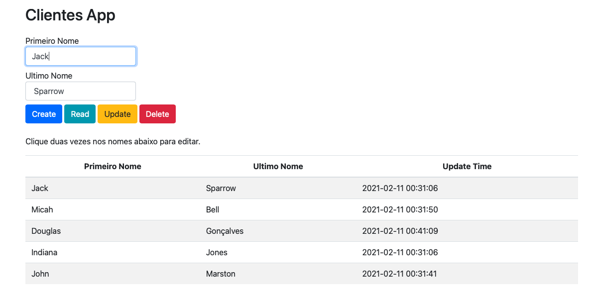

<h1 align="center">Python Api with Docker </h1>

 <p align="center">
   <a href="#-technologies">Technologies</a>&nbsp;&nbsp;&nbsp;|&nbsp;&nbsp;&nbsp;
   <a href="#-project">Project</a>&nbsp;&nbsp;&nbsp;&nbsp;&nbsp;&nbsp;
 </p>

 <p align="center">
    
 </p>

 ## :rocket: Technologies

 A simple api project build using Python, Swagger, MongoDB and Docker


 ## 💻 Project

You can run the container for this project on your own environment with the following:

```
> docker run --name clientes-microservice -it -p 5000:5000 -d douggoncalves/clientes_microservice
```

 ---
<h4 align="center">
   Code and coffee ☕
</h4>
